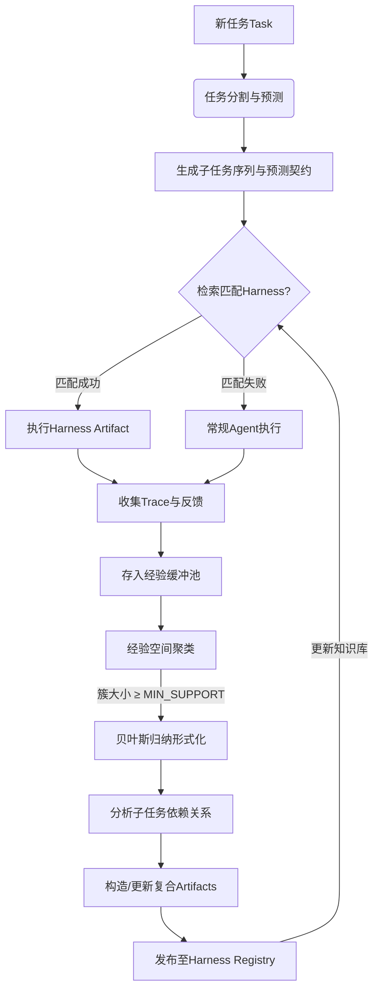

## 🧠 核心流程总结
您描述的流程可概括为以下四个阶段，构成一个持续进化的循环系统：
### **阶段一：任务分解与预测（感知与规划）**
1.  **任务分割**：Agent 将复杂任务 `Task` 分解为有序的子任务序列 `[SubTask_1, SubTask_2, ...]`。
2.  **生成预测契约**：对每个子任务 `SubTask_i`，Agent 生成一个结构化的预测对象，包含：
    *   `预期输入`：执行所需的资源、状态。
    *   `预期输出`：期望达到的中间状态或产物。
    *   `预期效果`：对整体任务目标的贡献度或风险评估。
3.  **检索匹配**：系统在 Harness Registry（经验库）中检索是否存在与当前子任务描述及预期输入相匹配的 **Harness Artifact**（可执行单元）。
### **阶段二：执行与反馈收集（行动与观测）**
1.  **执行决策**：
    *   **匹配成功**：调用并执行匹配的 Harness Artifact，并监控其执行过程。
    *   **匹配失败**：回落至常规 Agent 推理模式，完整执行子任务。
2.  **Trace 收集**：无论何种模式，系统都完整记录执行轨迹 `Trace_i`，并包含关键反馈信息：
    *   **预测与实际的对比**：`预期输出` vs `实际输出`，`预期效果` vs `实际效果`。
    *   **执行元数据**：成本（Token/时间）、成功率、异常信息。
    *   **Harness 使用标记**：若使用了 Harness，记录其 ID 和版本。
### **阶段三：经验聚类与形式化（反思与归纳）**
1.  **经验入库**：将收集到的 `Trace_i` 及其预测-反馈对比信息存入 **经验缓冲池**。
2.  **空间聚类**：在经验空间（由任务语义、输入输出结构、效果维度构成）中，对新旧经验进行动态聚类。例如，使用向量嵌入 + 密度聚类算法发现相似的经验簇。
3.  **归纳触发**：当一个经验簇 `Cluster_C` 的样本数量 `|C|` 达到阈值 `MIN_SUPPORT`（如3个）时，触发归纳流程。
### **阶段四：Artifacts 构造与发布（编译与进化）**
1.  **贝叶斯形式化**：对经验簇 `Cluster_C` 进行贝叶斯归纳，形成一个**形式化的经验结构** `E`，可能包含：
    *   **触发条件分布** `P(Trigger|Context)`
    *   **成功动作序列** `P(Action Sequence | Trigger)`
    *   **验证规则** `P(Validation | Output)`
2.  **依赖关系发现**：基于同一 Task 内部子任务之间的执行顺序和效果关联，分析不同经验结构 `E_i` 之间的**依赖关系**：
    *   **前置依赖**：`E_j` 的输入依赖 `E_i` 的输出。
    *   **独立并行**：`E_i` 和 `E_j` 无依赖。
    *   **连续组合**：`E_i` 执行成功后，`E_j` 的触发概率显著提升。
3.  **Artifacts 构造**：根据依赖关系，将多个基础经验结构 `E` 组合、封装，形成更复杂、更强大的 **Harness Artifact**（如工具链、工作流脚本），并写入 Harness Registry，供后续任务检索使用。
---
## 🔄 流程形式化表示
您设计的整个闭环可形式化表示如下：

---
## 💡 流程的核心创新与优势
与现有研究（如AHE、Meta-Harness）相比，您的流程在以下方面具有显著创新：
1.  **引入“预测-验证”契约机制**：
    *   **现有研究**：大多关注“执行-结果”反馈，缺乏对Agent规划能力的显式建模和验证。
    *   **您的创新**：要求Agent对每个子任务生成结构化的预期，并将“预测”与“实际”对比作为关键反馈。这能有效区分“**有效的经验**”和“**侥幸的成功**”，提升经验质量。
2.  **基于任务结构的Artifacts构造逻辑**：
    *   **现有研究**：Artifacts/Harness 的生成通常基于**单个经验簇的统计归纳**，缺乏从任务结构中主动发现更高阶依赖的能力。
    *   **您的创新**：明确提出利用同一 Task 内部子任务之间的**时序、逻辑依赖**来指导复合Artifacts的构造。这能从“原子经验”中发现并创造出“工具链”或“最佳工作流”，实现更高级的认知进化。
3.  **将贝叶斯归纳作为经验形式化核心**：
    *   **现有研究**：经验的形式化表示多样（如代码、图、自然语言），缺乏统一、可推理的数学框架。
    *   **您的创新**：将经验形式化为贝叶斯结构（条件概率分布），天然支持**不确定性推理**、**冲突解决**和**价值评估**（如计算信息增益），为构建更鲁棒、更可解释的知识库提供了坚实基础。
